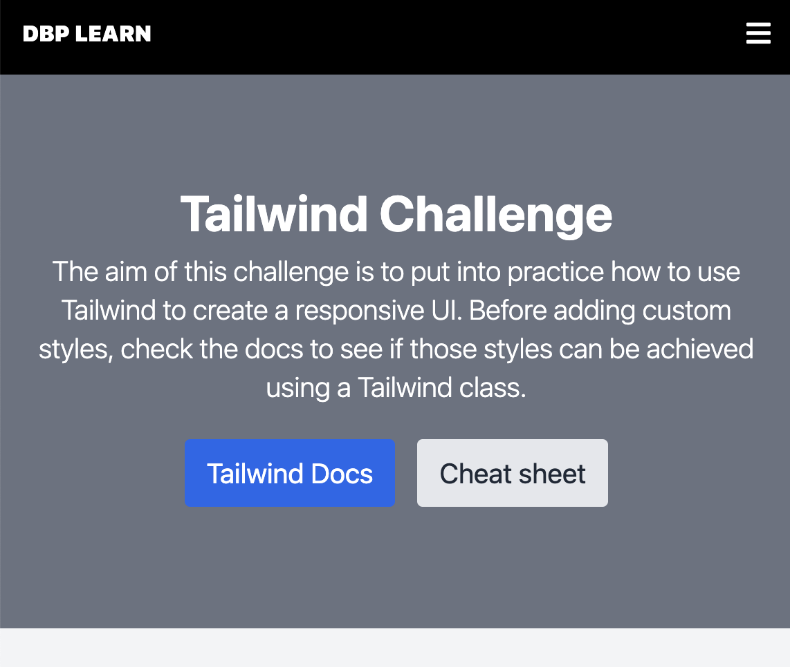
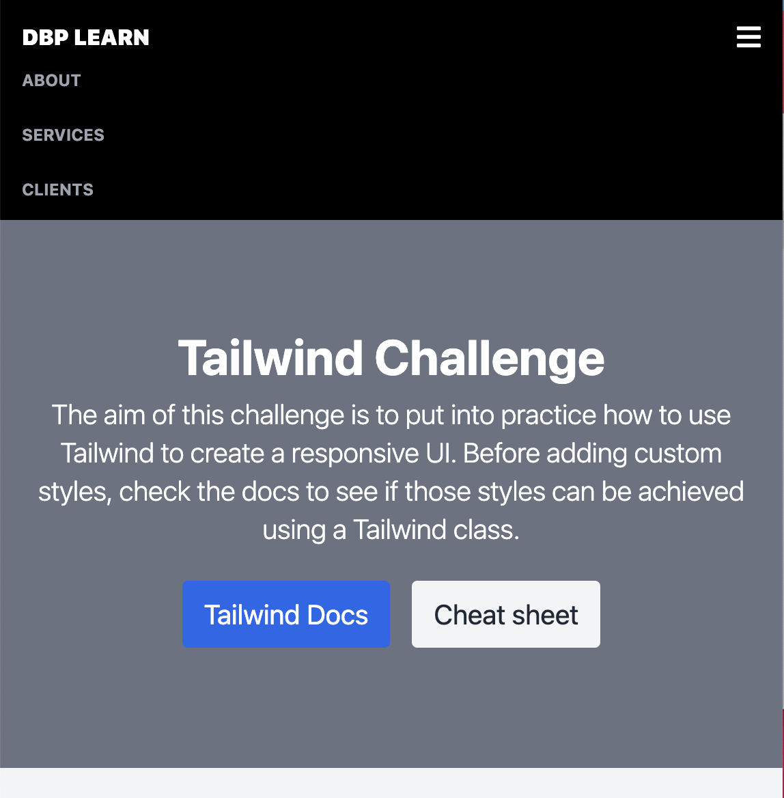
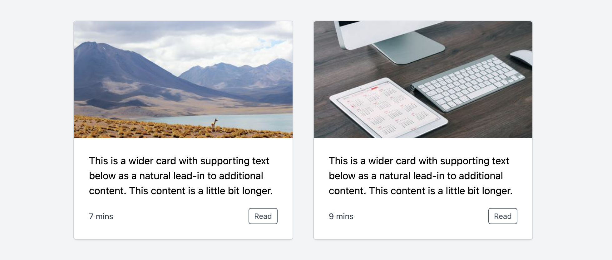
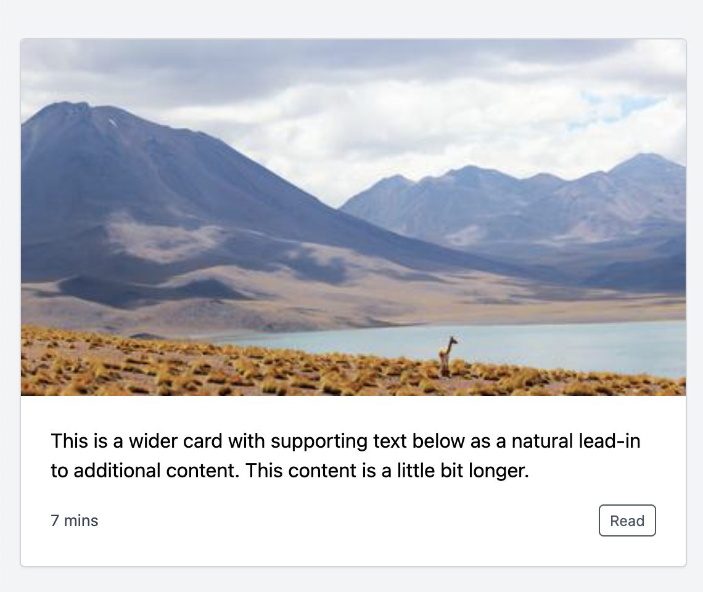

# Tailwind UI Challenge

For this challenge you will need to use [Tailwind](https://tailwindcss.com/docs/installation) classes to build the following responsive layout.

**This layout contains:**

1. A heading section.
2. A hero section.
3. A main section with a list of 9 responsive cards.
4. A footer section.

**Suggestions:**

- You can use random images from [Lorem Picsum](https://picsum.photos/) like this: https://picsum.photos/420/225?v=1, https://picsum.photos/420/225?v=2.
- You can start from this Tailwind seed project which already has the Tailwind libraries imported.

# What's expected

1. The header should be responsive. This means that on smaller screens, the menu options should collapse.

2. Cards should arrange responsively. This means that their layout has to change according to the screen size.
   - For _xs_ there should be 1 card per row, for _sm_ 2 and for _md and bigger_ 3.

# Objective

The purpose of this challenge is for you to practice your Tailwind skills by creating a real UI. Please note that there is no right or wrong way to solve this. What we want to see is how you can solve this responsive layout just by using Tailwind classes. Please try not to use any custom classes. Have fun playing with Tailwind!
